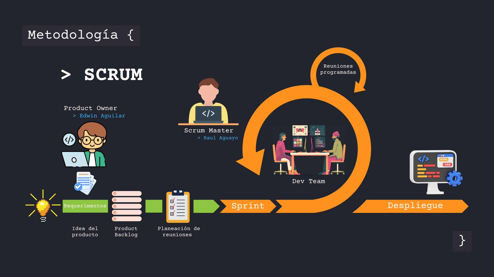

# Metodología empleada en el desarrollo

## Metodología agil Scrum
Nuestra metodología esta completamente apegada al modelo de metodolgía agil de SCRUM. La elección de esta metodología es la suma comondidad durante el manejo del desarrollo del software, permitiendonos tener una planificacíon mas comoda, rapida y agil para el despliegue de nuestro software.

